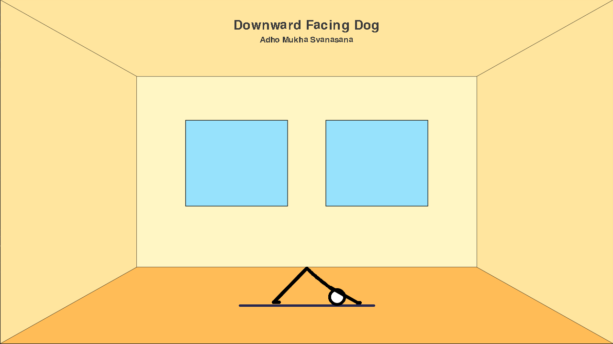

# Pyogini

A virtual Yoga lesson simulation software written in Python.

Let a stick figure yogini guide you through the asanas of the classical Ashtanga sequence.



## Requirements

You need to have `pygame` installed:

```bash
pip3 install --user pygame
```

## How to start

Unroll your mat and then launch the program by executing:

```bash
python3 main.py
```

Your yoga session starts right ahead.
